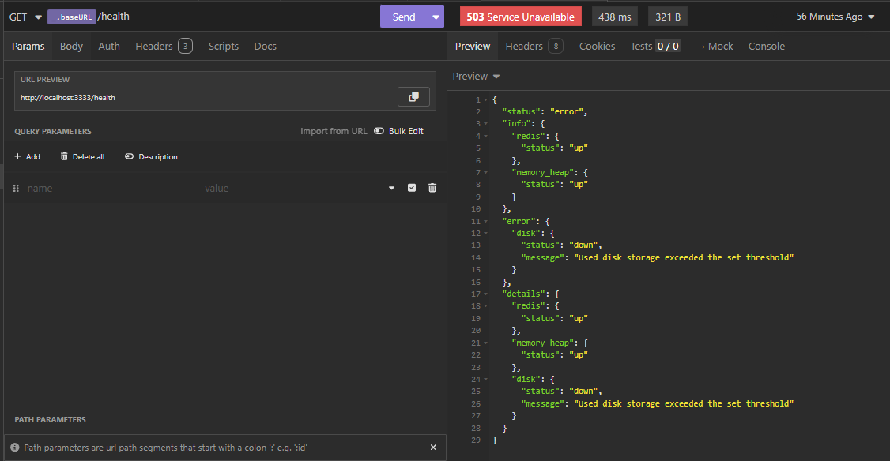
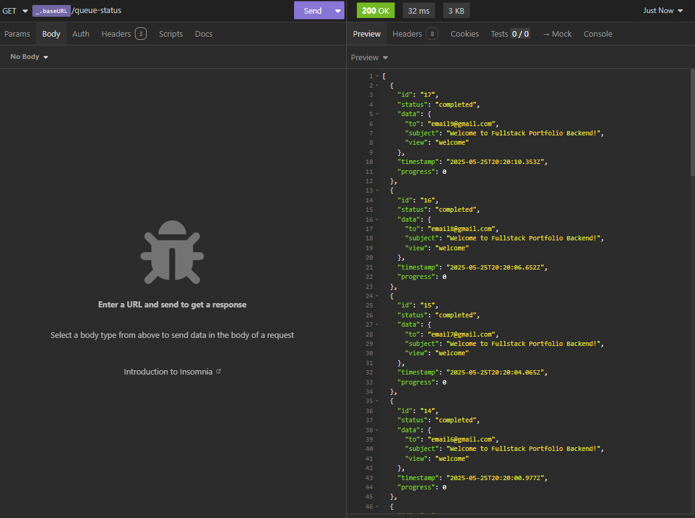

# Fullstack Portfolio Backend

Project created to demonstrate my advanced knowledge in back-end development, for portfolio purposes. Work in progress.

## Overview

This project was designed to be scalable and maintainable. It includes a carefully selected set of modern technologies and best practices to accelerate development while ensuring code quality and performance.

## Technologies & Purpose

### Core Technologies

- **[NestJS](https://nestjs.com/)**: A progressive Node.js framework for building efficient, reliable, and scalable server-side applications. Provides a robust architecture and excellent support for TypeScript.
  - Purpose: Serves as the main framework, providing a structured and modular approach to building the application.

- **[Prisma ORM](https://www.prisma.io/)**: Next-generation ORM for Node.js and TypeScript.
  - Purpose: Simplifies database operations with type-safe queries, automatic migrations, and a powerful schema management system.

- **[PostgreSQL](https://www.postgresql.org/)**: Advanced open-source relational database.
  - Purpose: Provides robust data storage with support for complex queries, transactions, and data integrity.

### Supporting Technologies

- **[Redis](https://redis.io/)**: In-memory data structure store.
  - Purpose: Used for caching, session management, and as a message broker for queues.

- **[Bull](https://github.com/OptimalBits/bull)**: Redis-based queue for Node.js.
  - Purpose: Handles background jobs, scheduled tasks, and distributed processing.

- **[JWT](https://jwt.io)**: JSON Web Token implementation.
  - Purpose: Manages authentication and secure user sessions.

- **[Nodemailer](https://nodemailer.com)**: Email sending module for Node.js.
  - Purpose: Handles all email communications within the application.

- **[Joi](https://github.com/sideway/joi)**: Schema description language and validator.
  - Purpose: Validates and sanitizes incoming request data.

- **[Nest Event Emitter](https://docs.nestjs.com/techniques/events)**: Event handling system.
  - Purpose: Implements event-driven architecture for better decoupling of application components.

- **[@nestjs/terminus](https://docs.nestjs.com/recipes/terminus)**: Health check library for NestJS.
  - Purpose: Provides ready-to-use health indicators and endpoints to monitor the application's health status, including database connections, Redis, and other critical services.

- **[Docker](https://www.docker.com/)**: Containerization platform.
  - Purpose: Ensures consistent development and deployment environments across different machines, simplifying the setup of dependencies like PostgreSQL and Redis.

## Features

- Databases with [Prisma ORM](https://www.prisma.io/)
- Queues with [Bull](https://github.com/OptimalBits/bull)
- Authentication with [JWT](https://jwt.io)
- Mail sending with [Nodemailer](https://nodemailer.com)
- Request validation with [Joi](https://github.com/sideway/joi)
- Event emitting with [Nest Event Emitter](https://docs.nestjs.com/techniques/events)
- Circuit breaker pattern implementation for event error handling and reprocessing
- Health checks with [@nestjs/terminus](https://docs.nestjs.com/recipes/terminus)

## Prerequisites

- A package manager (e.g. npm, yarn, pnpm)
- [Node.js](https://nodejs.org/)
- [NestJS CLI](https://docs.nestjs.com)
- [Redis](https://redis.io/) and [PostgreSQL](https://www.postgresql.org/) or [Docker](https://www.docker.com/)
- [Docker](https://www.docker.com/) and [Docker Compose](https://docs.docker.com/compose/) (optional, for containerized development)

## Installation

- Clone the repository

- Install dependencies

```bash
  $ npm install
```

- Copy the `.env.example` file to `.env`

- Setup the database

```bash
  $ npm run db:setup
```

- Run the application

```bash
  $ npm run start:dev
```

### Docker Installation

- Clone the repository

- Copy the `.env.example` file to `.env`

- Build and start the containers

```bash
  $ docker-compose up -d
```

This will start all necessary services (PostgreSQL, Redis, and the application) in containers.

To stop the containers:

```bash
  $ docker-compose down
```

### Endpoints

- Get the endpoints from the folder `workspaces`. Modules available:
  - [Insomnia](https://insomnia.rest/)

### Screenshots

- Health checks



- Queue status




